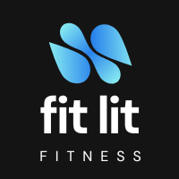

 

## About
Fit Lit is a locally-hosted, web-based application designed to help users track, log, and visualize their personalized fitness data. The dashboard-style interface allows users to access statistics in three broad categories-- activity, hydration, and sleep. Within each of these three categories, users can dig deeper to see information related to their daily, weekly, and all-time data.

---

## Set Up 

> ### Installing the files
> - Fork this [repository](https://github.com/RandyGitProjects/Fit-Lit) to your GitHub account. 
> - In your forked respository, click the `code` drop-down menu and copy the SSH key.
> - On your local machine, open the terminal using  `⌘ + space` and navigate to the location you'd like the flashcards repository directory cloned to. 
> - Once you're there, run `git clone [SSH Key] [Fit-Lit]` via the command line.
> - Run `npm install`. 

> ### Opening the application
> - When you're ready to use the app, open the terminal and navigate to the Fit-Lit directory via the terminal.
> - In the terminal, use command+t to open a new terminal tab. 
> - In the new terminal tab, run `npm start`.
> - Once WebPack has compiled the necessary resources, you will see a link within the text of your terminal. You can copy and paste that link into your browser to access a locally-hosted version of this application on your machine. 

---

## Preview

---

## Contributors
Randy Cisneros  [GitHub](https://github.com/RandyGitProjects) | [LinkedIn](https://www.linkedin.com/in/randy-cisneros-17006a191/)

Dustin Gouner  [GitHub](https://github.com/dustingouner) | [LinkedIn](https://www.linkedin.com/in/dustin-gouner/)

Em Lindvall  [GitHub](https://github.com/emlindvall) | [LinkedIn](https://www.linkedin.com/in/emilylindvall/)

Kelli Watkins [GitHub](https://github.com/klwats) | [LinkedIn](https://www.linkedin.com/in/kelli-watkins-1b73418b/)

---

## Context
This application was built while all colloborators were Mod 2 students at [Turing School of Software and Design Front End Web Development program](https://frontend.turing.edu/), a four- module, seven-month course focused on preparing students for a career as web developers working with Javascript, HTML, CSS, and the React framework. The application was built in two week-long sprints, and completed with the [Project Specification and Rubric](https://frontend.turing.edu/projects/module-2/fitlit-part-one-agile.html) in mind. Fit Lit accesses local server data, and was written utilizing JavaScript, HTML, CSS, WebPack bundler, and two third-party libraries ([Charts JS](https://www.npmjs.com/package/chart.js?activeTab=readme) and [Countdown JS](https://www.npmjs.com/package/countdown-js)). The development process was heavily on test-driven, especially in its earliest stages, and implemented user-testing feedback in its later stages. The application is fully-accessible via Voiceover and to users with colorblindness.

---

## Goals and Challenges 
The big-picture goal of this project was to synthesize and show our learning as new developers. Building the FitLit application tied together all of the skills, technologies, and tools that we've become familiar with, challenging us to implement our learning on a broader scale and deeper level than in any previous Turing project. We were also required to integrate a few tools and functionalities that were completely new to us-- primarily fetching API data and utilizing the bundler WebPack, and utilizing third-party libraries like JS Chart and Countdown JS. The learning curve in using these new tools was steep, and our group initially struggled specifically with importing and exporting fetched data, and later with reconciling data returns with the types of datasets needed to correctly populate a readable, functional chart graphic. Our team was also new to iterators, and although utlilzing them successfully was challenging at times, we were always able to put our heads together figure it out. 

## Future Development Opportunities
Given additional time, we would have liked to display several other datapopints graphically-- for example, on the steps chart, we'd like the chart to indicate whether a user made their steps goal for that date on mouseover. We also discussed displaying a user's overall steps for the week and overall sleep for the week within their respective charts. We would also like this application to have stronger accessibility features, especially in allowing users to navigate the data visualizations key keyboard selectability-- at the moment, JS Charts has not integrated this functionality, but if that were to change, we'd like to update our application to be fully usable without a trackpad or mouse. 

